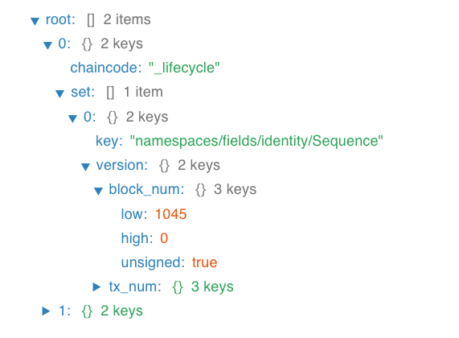
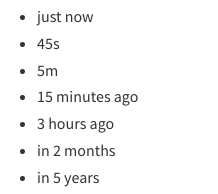

# Thư viện JavaScript

## Hiển thị cấu trúc json

`react-json-tree`




## Thời gian gần đây

`javascript-time-ago`
  - React: `react-time-ago`




## Copy to clipboard

`copy-to-clipboard`
  - React: `react-copy-to-clipboard`


## Verify schema JSON

`ajv`

```js
const schema = {
  type: "object",
  properties: {
    foo: {type: "integer"},
    bar: {type: "string"}
  },
  required: ["foo"],
  additionalProperties: false,
}

const data = {
  foo: 1,
  bar: "abc"
}

const validate = ajv.compile(schema)
const valid = validate(data)
if (!valid) console.log(validate.errors)
```